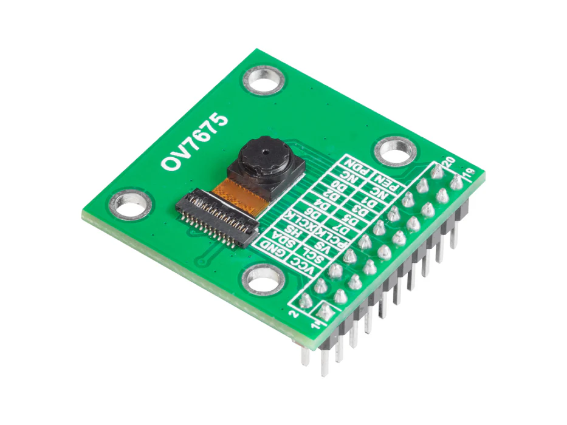
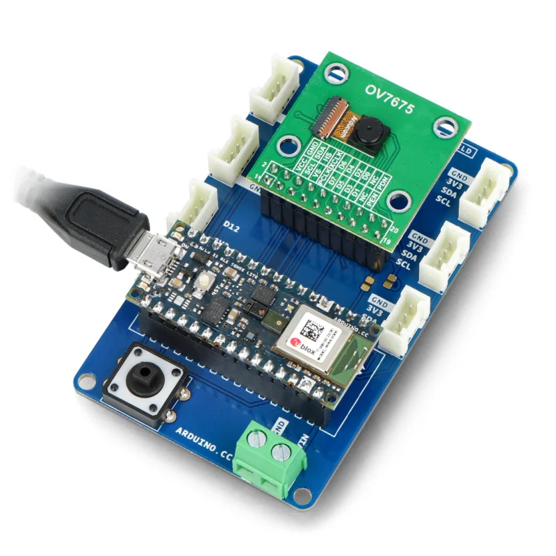
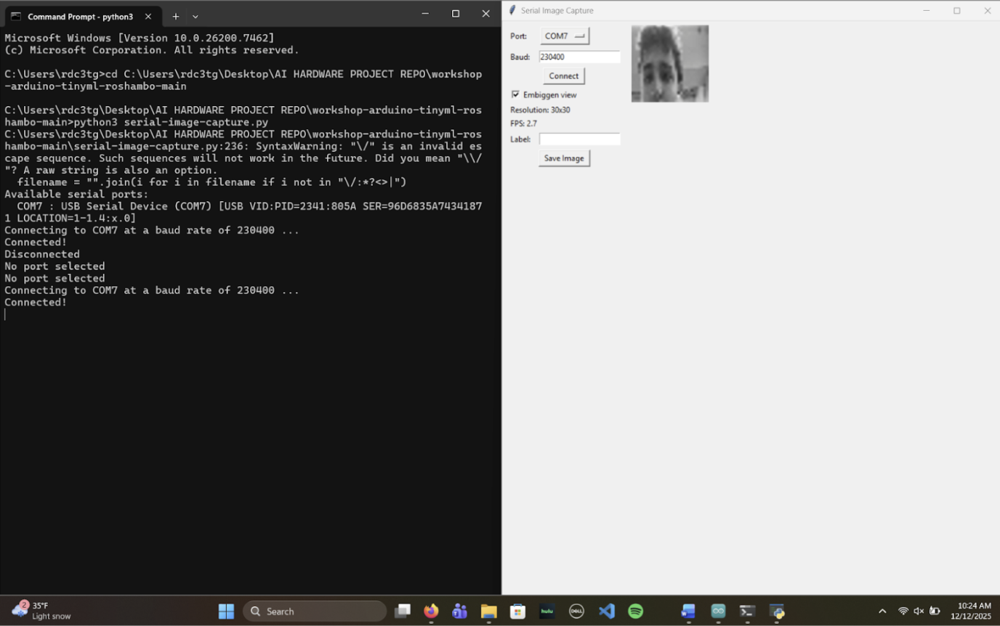

# AI Hardware Project - The AI Hardware Team
ECE 4332 / ECE 6332 — AI Hardware  
Fall 2025
* Grayson Turner
* Sammie Levine
* Nate Owen
* Marissa Cash

## Overview

The goal of this project is to use an Arduino Nano 33 BLE Sense Lite paired with an OV7675 camera module to perform basic facial recognition. The system is designed to detect and identify unique human faces and compare them against a dataset of reference profiles. Based on this face detected the device should be able to classfiy each face as either a known resident or simply "unknown." This simulates the integration of AI into the core logic of a smart doorbell camera system, which could be a possible application for this project in future uses. Our camera system captures images and processses them on the microcontroller and assigns identity labels to different visitors. The design demonstrates how edge solutions of AI hardware can be used in real life scenarios. The final system integrates image acquisition, feature processing and classification to show a complete demonstration of  real time visitor identification. 

Steps to build an image classification system that can identify a known resident or an unknown intruder: 
 1. Collect raw face images using the Arduino Nano 33 BLE Sense Lite and OV7675 camera
 2. Augment the dataset using Google Colab to increase training diversity
 3. Train a Convolutional Neural Network (CNN) using Edge Impulse
 4. Deploy the model for live, on-device facial recognition

## Team Setup
All team members worked together however our official team roles to make sure work was evenly distributed were:
  * **Grayson Turner:** Team Lead - coordination, documentation
  * **Nate Owen:** Hardware - setup, integration
  * **Sammie Levine:** Software - model training, inference 
  * **Marissa Cash:** Evaluation - testing, benchmark

## Implementation

### Software and Hardware Set Up

The system was built using an Arduino Nano 33 BLE Sense Lite paired with an OV7675 camera module from the TinyML kit. Software development was based on an Edge Impulse GitHub repository, which was adapted from an existing rock paper scissors image recognition project to instead perform facial recognition. The Arduino IDE was used for device side integration, while the Python code was used for model handling, data processing, and supporting scripts during development and training.

### Data Collection 

Face images were captured directly using the OV7675 camera on the Arduino device. Images were labeled into three categories: recognized person (known resident, labeled "Nate"), unknown, and background. Multiple images were collected under normal indoor lighting conditions to reflect a realistic door camera scenario. These labeled images were uploaded to Edge Impulse for training and validation. An example of this setup is shown in the image below:

### Run the program 

After the training, the model was deployed to the Arduino Nano 33 BLE Sense Lite using Edge Impulse. During execution, the device continuously captures images. Each frame produces classification probabilities for background, known resident (labeled "Nate"), and unknown. A confidence threshold of approximately 0.8 was used to determine positive identification, and classification results along with inference timing were streamed over the serial monitor for evaluation.

## Results

The Arduino camera successfully identified our known resident (Nate), unknown residents, and background scenes. Serial output showed consistent classification behavior, with unknown faces frequently classified with high confidence values near 0.996. When the known resident was present, the model produced "Nate" classification probabilities exceeding 0.9 in several trials.

The measured inference latency was approximately 140 milliseconds per frame, with DSP processing taking about 1 millisecond. This meets the project goal of near real time identification on embedded hardware. The model achieved an overall classification accuracy of approximately 84.7 percent based on Edge Impulse evaluation metrics, with a weighted F1 score of approximately 0.92. False positives were evluated by observing cases where non-"Nate" faces were incorrectly classified as Nate with confidence above 0.8 across multiple trials.

(Accuracy Statisc)

(Result Images)

## Folder Structure
- `docs/` – project proposal and documentation  
- `presentations/` – midterm and final presentation slides  
- `report/` – final written report (IEEE LaTeX and DOCX versions included)  
- `src/` – source code for software, hardware, and experiments  
- `data/` – datasets or pointers to data used

## 📋 Required Deliverables
1. **Project Proposal** — due Nov. 5, 2025, 11:59 PM  
2. **Midterm Presentation** — Nov. 19,2025, 11:59 PM  
3. **Final Presentation and Report** — Dec. 17, 11:59 PM

